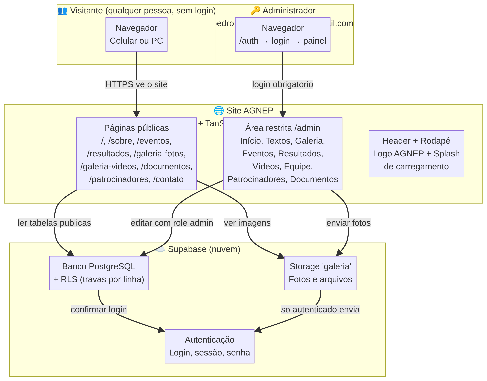

# Mapa do Sistema AGNEP — Como Tudo Se Conecta

Este documento explica, de forma simples, como cada parte do sistema se conecta às demais. Acompanhe o diagrama abaixo e depois a explicação de cada bloco.

## 1. Quem usa o sistema

Existem dois tipos de pessoas que interagem com o sistema. O **visitante** é qualquer pessoa que abre o site no celular ou no computador: ela vê todo o conteúdo público, mas não consegue alterar nada. O **administrador** é o dono do e-mail autorizado, que entra pelo endereço `/auth` com sua senha e, só então, tem acesso ao painel `/admin` com os recursos de edição.

## 2. O site (a "vitrine")

O site é o conjunto de telas que as pessoas veem. Ele é dividido em três camadas: as **páginas públicas** (início, sobre, eventos, resultados, galerias, documentos, patrocinadores e contato), a **área restrita** (os nove módulos do painel administrativo) e os **componentes de moldura** (o cabeçalho com o menu e o logo, o rodapé com o Instagram e a tela de carregamento). Quando uma página precisa de dados — por exemplo, a galeria precisa das fotos de um torneio —, ela faz uma pergunta ao banco de dados pela internet, de forma segura, e exibe a resposta.

## 3. O Supabase (o "cofre" na nuvem)

O Supabase é o serviço de nuvem que guarda três coisas: a **autenticação** (quem são os usuários, senhas criptografadas e sessões de login), o **banco de dados PostgreSQL** (todos os textos, eventos, resultados, álbuns e fotos do site) e o **armazenamento** (bucket `galeria`, onde ficam os arquivos de imagem enviados). A regra de ouro do sistema é: o visitante só consegue **ler** os dados públicos; qualquer escrita (criar, editar, apagar) exige login e a função de administrador, e essas travas ficam **no banco de dados**, não apenas no site — mesmo que alguém tente atacar o banco por fora, as políticas de RLS barram a operação.

## 4. Como o dado viaja (um exemplo completo)

Para entender a conexão na prática, imagine o administrador criando um álbum de fotos de um torneio. Primeiro ele entra em `/auth` e o Supabase verifica a senha, devolvendo um **token de sessão** que fica guardado no navegador. Em seguida, no painel de galeria, ele cria o álbum — a solicitação viaja até o banco, que consulta a tabela `user_roles`, confirma que o e-mail é o administrador e grava o álbum. Depois ele escolhe fotos da biblioteca e anexa ao álbum — os arquivos de imagem sobem para o bucket `galeria` (que só aceita envios de quem está logado) e os registros de legenda são gravados na tabela `fotos`. Por fim, qualquer visitante que abrir a página da galeria lê esses mesmos registros, que o banco libera publicamente por serem marcados como álbum publicado.

## 5. Mapa das conexões de dados (tabelas)

| Tabela do banco | O que guarda | Quem pode ler | Quem pode escrever |
|---|---|---|---|
| `site_content` | Textos das páginas (início, sobre, contatos) | Todos | Só admin |
| `site_stats` | Contadores da página inicial | Todos | Só admin |
| `eventos` | Calendário de eventos e torneios | Todos | Só admin |
| `resultados` | Medalhas, troféus e títulos | Todos | Só admin |
| `albuns` | Álbuns da galeria pública | Todos | Só admin |
| `fotos` | Fotos anexadas aos álbuns | Todos | Só admin |
| `biblioteca` | Fotos internas do site (decoração) | Todos (previews) | Só logado |
| `videos` | Vídeos do YouTube | Todos | Só admin |
| `equipe` | Perfis da equipe | Todos | Só admin |
| `patrocinadores` | Parceiros e apoiadores | Todos | Só admin |
| `documentos` | Arquivos para download | Todos | Só admin |
| `content_blocks` | Blocos de texto editáveis | Todos | Só admin |
| `user_roles` | Quem é administrador | Limitado | Só admin |
| `admin_audit_log` | Registro de todas as alterações | Só admin | Sistema/admin |

## 6. Resumo em uma frase

O visitante vê o site; o site pergunta ao banco; o banco só responde o que é público; o administrador, depois de provado pelo login, é o único que consegue escrever — e tudo que ele escreve fica gravado na auditoria.
